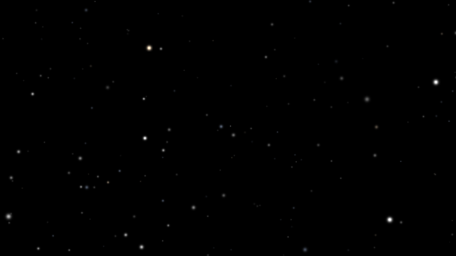
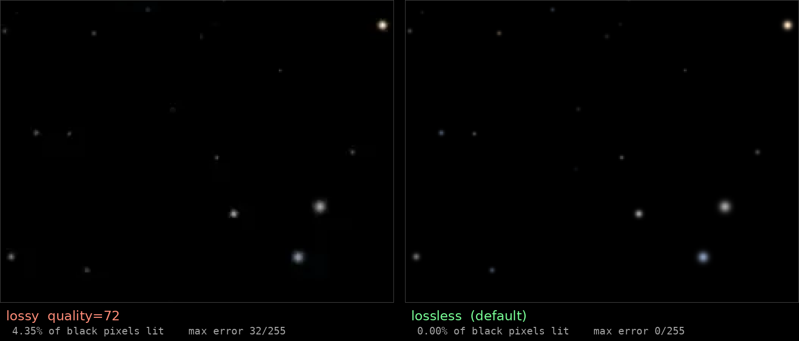

# starfield-wallpaper

Generate a seamlessly-looping animated starfield wallpaper, designed specifically
for OLED displays.

The output is an animated WebP: a pure-black field of stars that slowly drift and
twinkle, looping perfectly with no visible seam.



*Preview: 640×360, 10 s loop. The real thing defaults to 2560×1440 with a 33 s
loop and a denser field.*

---

## Stuck? Point an AI agent at it and go to town

If any of this doesn't work on your machine, don't fight it — hand the whole
repository to your favourite coding agent and tell it what you want.

This project is deliberately shaped for that. It's three short Python files with
no framework, no build step, and comments that explain *why* rather than just
what. Clone it, open the directory in Claude Code, Codex, Cursor, Aider or
whatever you use, and describe the outcome in plain language:

> "Render this at 3440×1440 for my ultrawide, make the stars about half as dense
> and the motion noticeably slower, then set it as my wallpaper."

> "It renders but my desktop shows a still frame instead of animating — work out
> why and fix it."

Everything an agent needs is here. Every knob is a documented CLI argument. The
one genuinely counter-intuitive constraint — motion speed scales with
*harmonic ÷ loop length*, so changing the frame count silently changes the speed —
is called out in `--help` and below. Both encoding traps are written up with the
measurements behind them, so an agent won't burn your evening rediscovering that
lossy WebP rings around stars or that ffmpeg writes no frame durations.

The genuinely fiddly part is wiring the result into your particular desktop, and
that's precisely what an agent is good at: it can inspect your actual system,
find the right config keys, and verify the result rather than guessing from a
guide written for someone else's setup.

---

## Why this exists rather than just downloading a video loop

Most animated wallpapers are actively bad for an OLED panel. This one is built
around three properties that matter on that hardware.

### Pure black, not dark grey

99% of pixels in the output are exactly `0,0,0`. On OLED those pixels are
**genuinely off** — no light emitted, no wear accumulated, no power drawn.

It also matters for how bright the rest of your screen looks. OLED panels have an
automatic brightness limiter driven by average picture level. A typical panel might
advertise 600 nits peak but cap full-screen output around 150 nits; a bright
wallpaper raises the average and the panel clamps *everything* dimmer, including
the window you're actually reading. A near-black wallpaper keeps that headroom.

### Motion that loops perfectly without being fast

The obvious approach — drift the stars sideways — only loops seamlessly if the
field wraps a whole screen width per cycle. At 2560px that forces either a very
long file or uncomfortably fast motion.

Instead, each star has a **sinusoidal position wobble and brightness twinkle at
integer harmonics** of the loop. Sinusoids at integer harmonics return exactly to
their starting state, so the loop is mathematically seamless at *any* frame count
while the motion stays as slow as you like. Measured seam on the default settings:
**0.10 / 255**, which is imperceptible.

### Nothing bright stays still

Every lit pixel moves and varies in brightness, so wear is spread rather than
concentrated. This is the whole reason to prefer an animated wallpaper over a
static one — and it's why a loop with a *fixed* bright element (a logo, a static
horizon) is worse than a plain still image you rotate occasionally.

---

## Requirements

```
python3   >= 3.9
numpy
pillow
```

```bash
pip install numpy pillow
```

No ffmpeg needed — see the encoding notes below for why.

---

## Usage

Render the frames, then encode them:

```bash
python3 make_starfield.py /tmp/starframes
python3 encode_webp.py /tmp/starframes starfield-oled.webp
python3 verify_webp.py starfield-oled.webp --frames /tmp/starframes
```

Defaults produce 2560×1440, 500 frames at 15 fps — a **33.5 second loop**, about
14 MB. Rendering takes roughly 80 seconds and encoding about two minutes on a
modern desktop.

Frames are intermediate; delete `/tmp/starframes` once you have the WebP.

### Tuning

```bash
# 4K, denser field
python3 make_starfield.py /tmp/f --width 3840 --height 2160 --stars 1400

# calmer: slower motion via lower harmonics
python3 make_starfield.py /tmp/f --twinkle-lo 1 --twinkle-hi 4 --wobble-lo 1 --wobble-hi 3

# different star layout, same behaviour
python3 make_starfield.py /tmp/f --seed 12345
```

**Speed is proportional to `harmonic ÷ loop length.`** This trips people up:
lengthening the loop slows the motion on its own. Going from 180 to 500 frames
(2.78×) while wanting motion only 40% slower means scaling the harmonics up by
about 1.5× to compensate. `make_starfield.py --help` repeats this.

---

## Two encoding traps

Both of these were found by measuring output rather than trusting the tools, and
both are silent failures.

### Lossy WebP rings badly around stars

A 1–3px bright star on pure black is the worst case for a lossy block transform.
It can't represent that much local contrast, so error smears across the block as
a visible cross-shaped halo around every bright star.

Measured against the source frames, 2560×1440, 500 frames:

| config | size | dirty black px | max error |
|---|---|---|---|
| lossy q72 | 5.1 MB | **1.38%** | 37 |
| lossy q90 | 7.1 MB | 0.55% | 26 |
| lossy q98 | 12.0 MB | 0.17% | 20 |
| **lossless** | 14.5 MB | **0.00%** | **0** |

"dirty black px" is the share of should-be-black pixels that decoded to non-zero.
On OLED that column matters twice over — those pixels are both visible artefacts
*and* emitting light, defeating the point of the black background. Lossless is the
default here for that reason.

### ffmpeg writes no frame durations

`ffmpeg`'s `libwebp_anim` muxer produces a structurally valid animation with **no
per-frame duration**, leaving playback speed to whatever the viewer guesses. This
project uses Pillow, which writes ANMF durations correctly.

Verifying that is its own trap: Pillow *reports* durations as `None` when reading
WebP even when they're present, and ffmpeg's native decoder returns zero frames for
animated WebP. `verify_webp.py` walks the RIFF chunks directly, which is the only
reliable check.

---

## Setting it as your wallpaper

### KDE Plasma 6

The stock **Image** wallpaper plugin handles animated WebP — no extra plugin needed.
Right-click desktop → Configure Desktop and Wallpaper → Image, then pick the file.

One catch: the plugin has a `ForceImageAnimation` setting that defaults to **false**,
which leaves you looking at a still frame. It isn't exposed in the GUI. Enable it per
desktop:

```bash
gdbus call --session --dest org.kde.plasmashell --object-path /PlasmaShell \
  --method org.kde.PlasmaShell.evaluateScript '
var ds = desktops();
for (var i = 0; i < ds.length; i++) {
    ds[i].wallpaperPlugin = "org.kde.image";
    ds[i].currentConfigGroup = ["Wallpaper", "org.kde.image", "General"];
    ds[i].writeConfig("Image", "file:///path/to/starfield-oled.webp");
    ds[i].writeConfig("ForceImageAnimation", true);
    ds[i].reloadConfig();
}'
```

If you replace the file later at the same path, Plasma caches it — restart the shell
with `systemctl --user restart plasma-plasmashell.service` to pick up the change.
That restarts only the shell, not the compositor, so your windows are unaffected.

### Other desktops

GNOME doesn't support animated wallpapers natively. Sway/Hyprland can use
`mpvpaper` or `swww`. Note that layer-shell tools like those conflict with KDE's
plasmashell over desktop ownership — on Plasma, use the Image plugin above.

---

## Troubleshooting

Every problem below was hit for real while building this.

### Blocky halos or cross-shaped smudges around the bright stars



You encoded lossy. A 1–3px bright star on pure black is the worst case for a
lossy block transform — it can't represent that much local contrast, so the error
smears across the block.

The left panel above is `quality=72`, the right is the lossless default, same
source frame and same crop at 3× zoom. **4.35% of should-be-black pixels came back
lit**, some as bright as 32/255.

Fix: drop `--lossy`. It's off by default, so this only happens if you asked for it.

### It renders, but my desktop shows a still frame

On KDE Plasma the Image wallpaper plugin has a `ForceImageAnimation` setting that
defaults to **false** and isn't exposed anywhere in the GUI. See
[Setting it as your wallpaper](#setting-it-as-your-wallpaper) for the one-liner
that enables it.

### I replaced the file but the wallpaper didn't change

Plasma caches the wallpaper by path. Restart the shell:

```bash
systemctl --user restart plasma-plasmashell.service
```

That restarts only the shell — the compositor and your windows are unaffected.

### I changed `--frames` and now the motion is a different speed

Expected. Apparent speed is proportional to **harmonic ÷ loop length**, so a longer
loop is a slower loop with everything else held constant. Going from 180 to 500
frames (2.78× longer) slows motion to 0.36× on its own.

To lengthen the loop while controlling speed, scale the harmonic ranges to
compensate. For 2.78× longer but only 40% slower, multiply them by about 1.5:

```bash
python3 make_starfield.py /tmp/f --frames 500 \
  --twinkle-lo 2 --twinkle-hi 7 --wobble-lo 2 --wobble-hi 4
```

### `ffprobe` says the file has 0 frames, or Pillow reports no durations

Both tools are wrong about animated WebP, in different ways. ffmpeg's native
decoder returns zero frames for animated WebP, and Pillow reports per-frame
durations as `None` when reading even when they're correctly present.

Use `verify_webp.py`, which walks the RIFF chunks directly:

```bash
python3 verify_webp.py starfield-oled.webp --frames /tmp/starframes
```

### The whole desktop looks dimmer with this wallpaper than without

Unlikely — this one is *very* dark by design — but if you modified it to be
brighter, that's OLED automatic brightness limiting. Panels cap sustained
full-screen output well below their peak (a typical spec is ~600 nits peak against
a ~150 nit frame-average cap), so raising the wallpaper's average picture level
makes the panel clamp everything dimmer. Keep the background black.

---

## License

MIT — see [LICENSE](LICENSE).
